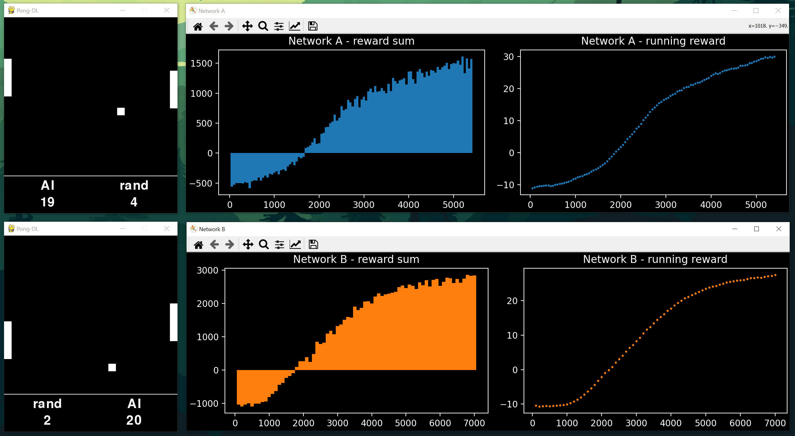

# Pong-DL
Deep Learning Pong

A variation on the classic Pong game in which the player can face a computer opponent powered by
a deep neural network implemented on the basis of the post and script by Andrej Karpathy:
* [Deep Reinforcement Learning: Pong from Pixels](http://karpathy.github.io/2016/05/31/rl/)
* [Training a Neural Network ATARI Pong agent with Policy Gradients from raw pixels](https://gist.github.com/karpathy/a4166c7fe253700972fcbc77e4ea32c5)

It is possible to train your own neural networks and play with them or watch the game between two networks.
The game also offers a two-player mode.

## Screenshots
&nbsp;&nbsp;&nbsp;&nbsp;&nbsp;&nbsp;&nbsp;&nbsp;

## System requirements
* Python 3.8.5
* Pygame 2.0.0

## Manual
Here is an overview of game parameters located in the main application script: _main.py_.

### Demo

Running _main.py_ with the values given below shows the game between two pretrained neural networks saved by default in the _nets_ folder:
* net_A_csize(46, 42)_bsize2_bspeed2_psize(2, 10)_pstep3_h200
* net_B_csize(46, 42)_bsize2_bspeed2_psize(2, 10)_pstep3_h100

It also displays the training history of both networks (see attached screenshots).
You can control the game speed by pressing the '-' or '+' keys on the numeric keypad.

### Game settings

`player_A = 'AI'` 
`player_B = 'AI'` 

Players' choice. The options available:
* 'player' -- a live player
* 'AI' -- a neural network
* 'rand' -- a racket with random positions, recommended for training neural networks
* 'trainer' -- a racket following the ball, you can use it to train your neural networks, but 'rand' gives better reults

Paddle controls:
* player_A -- 'W' and 'S' keys
* player_B -- arrow keys: ▲ and ▼

`pixel = 15` -- pixel size (all dimensions are defined as its multiple). you can control the size of the game window with this parameter. 
`ball_size = 2` -- ball size 
`ball_base_speed = 2` -- ball base speed in horizontal direction 
`court_size = (46, 42)` -- court size (x, y) 
`paddle_size = (2, 10)` -- paddle size (x, y) 
`paddle_step = 3` -- paddle step 
`game_base_speed = 20` -- base game speed (in the absence of a live player, the default is 4096). The speed of the game can be controlled during the game using the keys '-' and '+' on the numeric keypad 
`max_score = 21` -- the number of points to be scored in a single game 

### Neural network settings

`net_A _(net_B)_ = Network(` -- _A_ network settings (the values for _B_ network are given in brackets) 
&nbsp;&nbsp;&nbsp;&nbsp;`name="A", ("B")` -- network name 
&nbsp;&nbsp;&nbsp;&nbsp;`input_size=46*42,` -- number of input data nodes - the size of the field in previously defined pixels 
&nbsp;&nbsp;&nbsp;&nbsp;`hidden_size=200, _(100)_` -- number of hidden layer nodes 
&nbsp;&nbsp;&nbsp;&nbsp;`gamma=0.98 _(0.95)_,` -- discount factor for reward 
&nbsp;&nbsp;&nbsp;&nbsp;`decay_rate=0.99,` -- decay factor for RMSProp leaky sum of grad^2 
&nbsp;&nbsp;&nbsp;&nbsp;`batch=50 _(100)_,` -- every how many episodes to do a param update? 
&nbsp;&nbsp;&nbsp;&nbsp;`learn_rate=1e-3,` -- learning rate 
&nbsp;&nbsp;&nbsp;&nbsp;`strategy='defense',` -- game strategy. Options available: 'defense' - the net learns only to bounce the ball and defend its goal (quick learning), 'defense-attack' - the net learns to bounce the ball 
&nbsp;&nbsp;&nbsp;&nbsp;`resume=True)` -- should the network continue previous training? 
If _True_ the program will load the network from a file: _nets/net_{name}_h{hidden_size}_ 
If the file does not exist, a new network will be created.

### Plots

If the _plotting_ function is _True_, the program displays the progress history (assuming any of the players has been set to 'AI').

* _Reward sum_ is the sum of the rewards over _x_ games (_x = batch_).
If the net strategy is 'defense', reward = 1 if the net-controlled paddle bounces the ball, reward = -1 if it misses the ball and 0 otherwise.
When net strategy is 'defense-attack', reward = 1 if net-controlled player scores a point or reward = -1 if he loses a point.

* _Running reward_ is the average reward from the last (_batch_ * 10) games.

## Status
Project is: _progress_
