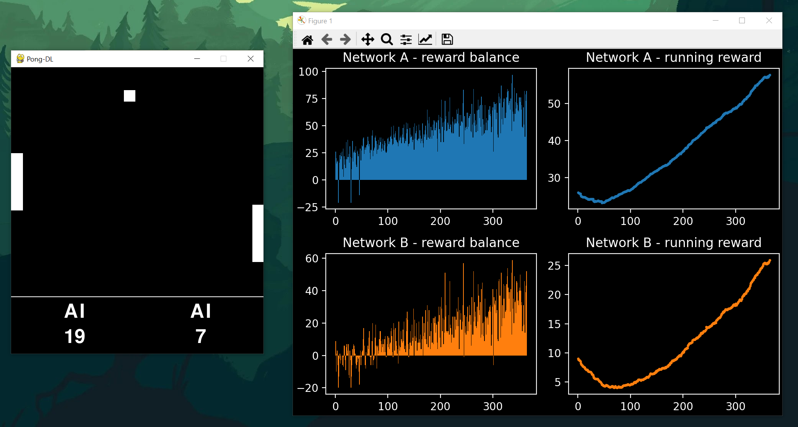

# Pong-DL
Deep Learning Pong

Based on Adnrej Karpathy's:
[Deep Reinforcement Learning: Pong from Pixels](http://karpathy.github.io/2016/05/31/rl/)
[Training a Neural Network ATARI Pong agent with Policy Gradients from raw pixels](https://gist.github.com/karpathy/a4166c7fe253700972fcbc77e4ea32c5)

## System requirements
* Python 3.8.5
* Pygame 2.0.0

## Technologies
* Python 3.8.5
* Pygame 2.0.0

## Manual
* Python 3.8.5
* Pygame 2.0.0

## Status
Project is: _progress_

## Snapshot

