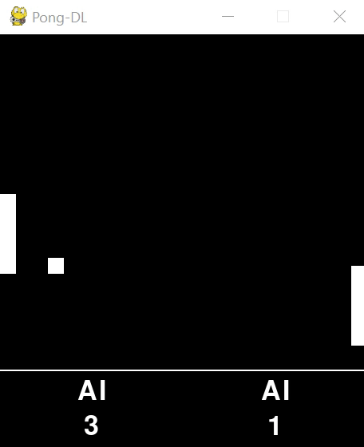

# Pong-DL
Deep Learning Pong

A variation on the classic Pong game in which the player can face a computer opponent powered by
a deep neural network implemented on the basis of the post and script by Andrej Karpathy:
* [Deep Reinforcement Learning: Pong from Pixels](http://karpathy.github.io/2016/05/31/rl/)
* [Training a Neural Network ATARI Pong agent with Policy Gradients from raw pixels](https://gist.github.com/karpathy/a4166c7fe253700972fcbc77e4ea32c5)

It is possible to train your own neural networks and play matches with them or watch the network vs. network.
The game also offers a two-player mode.

## Screenshots
 

## System requirements
* Python 3.8.5
* Pygame 2.0.0

## Manual
Here is an overview of individual game parameters located in the main application script: _main.py_.
Demo: Running _main.py_ with the values ​​given below displays the game between two pretrained neural networks whose models are saved by default in the _models_ folder.

### Game settings

`player_A = 'AI'` 
`player_B = 'AI'` 

Players' choice. The options available:
* 'player' - a live player
* 'AI' - a neural network
* 'trainer' - a racket following the ball
* 'rand' - a racket with random positions, useful for training artificial intelligence

Paddle controls:
* player_A - 'W' and 'S' keys
* player_B - arrow keys: ▲ and ▼

`pixel = 10` -- pixel size (all dimensions are defined as its multiple) 
`ball_size = 2` -- ball size 
`ball_base_speed = 2` -- ball base speed in horizontal direction 
`court_size = (46, 42)` -- court size (x, y) 
`paddle_size = (2, 10)` -- paddle size (x, y) 
`paddle_step = 3` -- paddle step 
`game_base_speed = 20` -- base game speed (in the absence of a live player, the default is 4096). The speed of the game can be controlled during the game using the keys '-' and '+' on the numeric keypad 
`max_score = 21` -- the number of points to be scored in a single match 

### Neural network settings
`net_A (net_B) = Network(` -- _A_ network settings (the values ​​for _B_ network are given in brackets) 
&nbsp;&nbsp;&nbsp;&nbsp;`name="A", ("B")` -- network name 
&nbsp;&nbsp;&nbsp;&nbsp;`input_size=46*42,` -- number of input data nodes - the size of the field in previously defined pixels 
&nbsp;&nbsp;&nbsp;&nbsp;`hidden_size=400 (200),` -- number of hidden layer nodes 
&nbsp;&nbsp;&nbsp;&nbsp;`gamma=0.98,` -- discount factor for reward 
&nbsp;&nbsp;&nbsp;&nbsp;`decay_rate=0.99,` -- decay factor for RMSProp leaky sum of grad^2 
&nbsp;&nbsp;&nbsp;&nbsp;`batch=10,` -- every how many episodes to do a param update? 
&nbsp;&nbsp;&nbsp;&nbsp;`learn_rate=1e-3,` -- learning rate 
&nbsp;&nbsp;&nbsp;&nbsp;`strategy='defense',` -- game strategy. Options available: 'defense' - the net learns only to bounce the ball and defend its goal (quick learning), 'defense-attack' - the net learns to bounce the ball 
&nbsp;&nbsp;&nbsp;&nbsp;`resume=True)` -- should the network continue previous training and load the model from a file? 

## Status
Project is: _progress_
